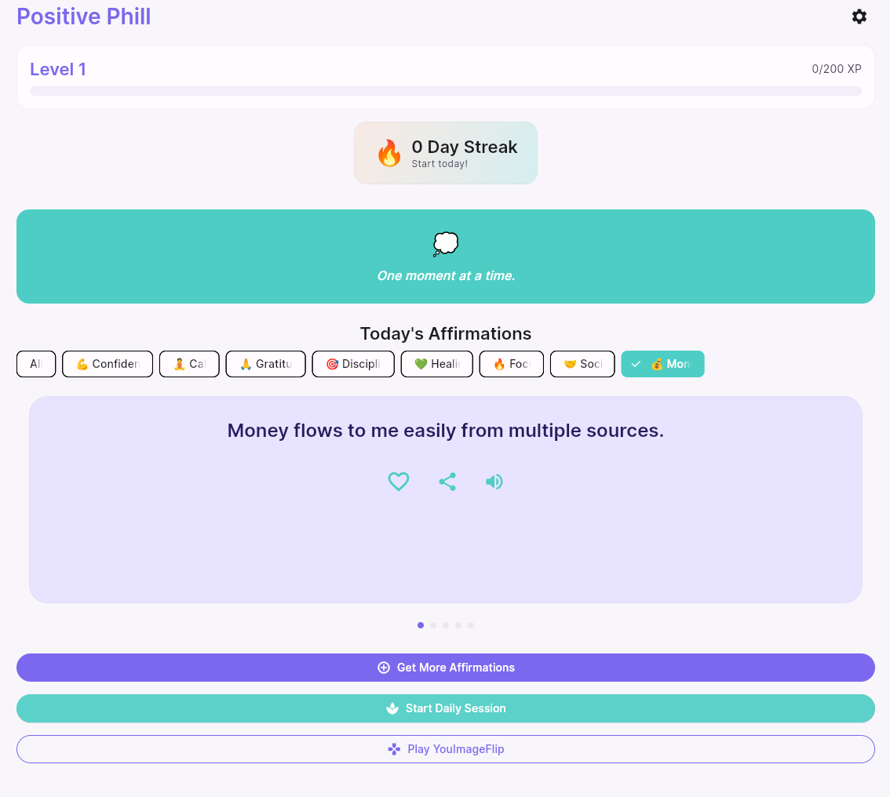
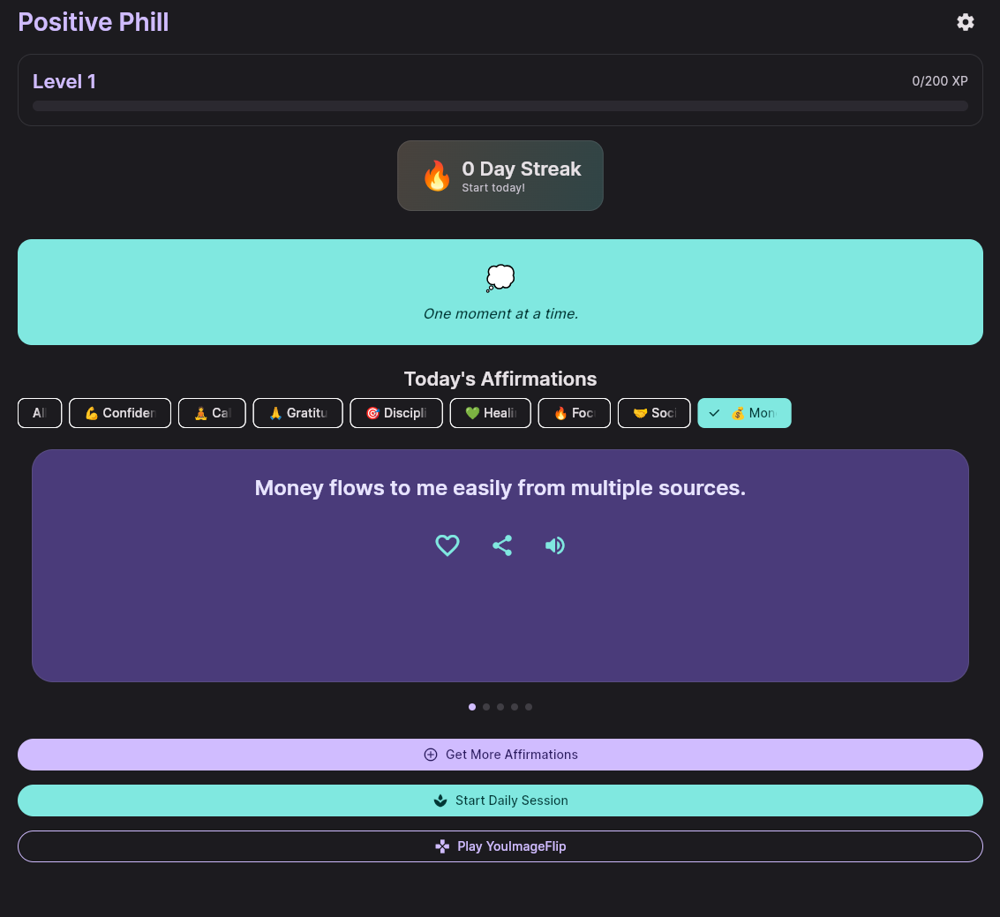
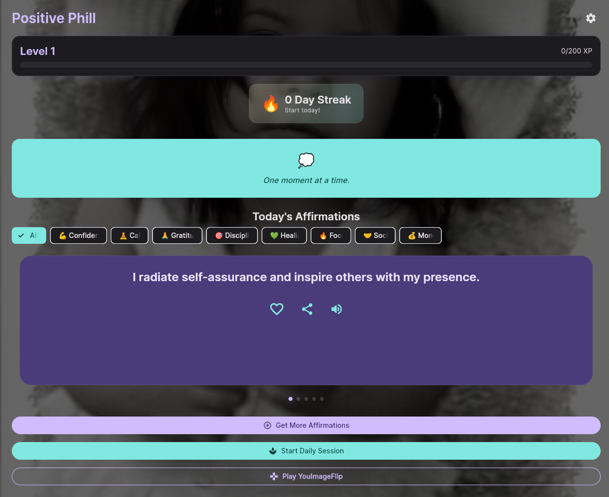
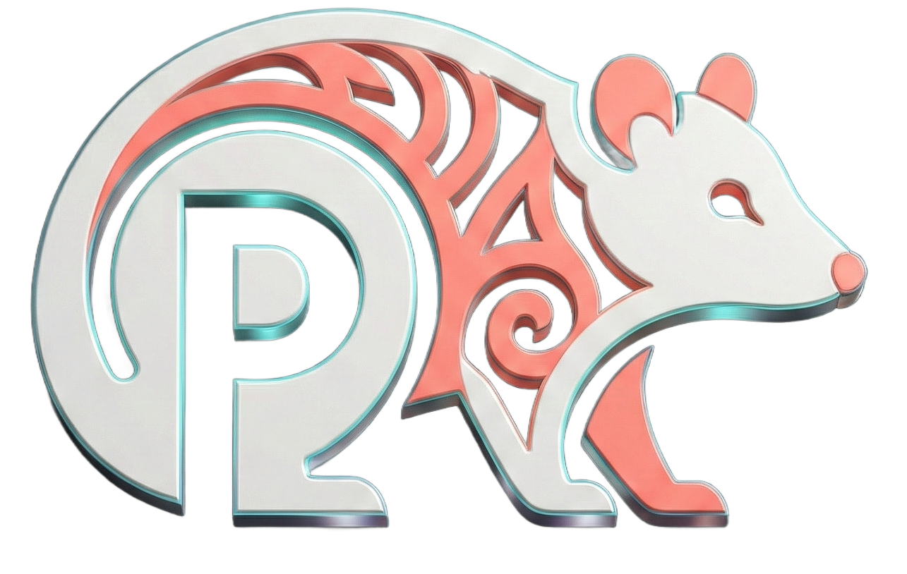

# Positive Phill 🌤️


> **"Your Daily Habit of Positivity."**

Positive Phill is a cross-platform wellness application designed to build mental resilience through daily affirmations, gamification, and accessibility-first design. Built with **Flutter**, it features a robust service-based architecture, local persistence, and native platform integrations.
Designed for users seeking a calm, accessible, and habit-forming daily positivity practice.

---

## 🔗 Live Demo
Try the web version instantly:
👉 **[Launch Positive Phill (Web)](https://positivephill.github.io/positive-phill/)**

---

## 📱 Screenshots

| **Home (Light)** | **Home (Dark)** | **Inspirational Board** |
|:---:|:---:|:---:|
|  |  |  |


## 🚀 Key Features

### 🌟 Core Experience
* **Daily "Vibe Check":** Dynamic content generation based on user mood (Confidence, Calm, Focus, etc.).
* **Inspirational Board:** Custom background engine allowing users to upload personal photos with automatic contrast overlays.
* **Accessibility:** Integrated Text-to-Speech (TTS) engine for audible affirmations.

### 🎮 Gamification Engine
* **XP & Leveling:** Users earn XP for daily sessions and "favorites."
* **Streak System:** Logic to track consistency and reward retention.
* **Celebrations:** Confetti particle effects for milestone achievements.

### 🛠 Technical Highlights
* **Cross-Platform:** Single codebase running natively on Android & iOS, with a graceful fallback PWA for Web.
* **Smart Caching:** `shared_preferences` persistence for offline streaks, XP, and settings.
* **Native Integrations:**
    * **Haptics:** Tactile feedback for interactions.
    * **Notifications:** Local scheduling for daily reminders.
    * **File I/O:** Abstracted file handling for Platform-Specific (Mobile vs Web) image storage.

---

## 🏗️ Architecture

The project follows a **Service-Locator** pattern with **Provider** for state management, ensuring a separation of concerns between logic, data, and UI.

```text
lib/
├── config/              # Constants & App-wide Config
├── models/              # Data Models (UserProgress, Affirmation)
├── platform/            # Platform-Specific Interfaces (Web/IO Stubs)
├── providers/           # State Management (UserProvider, ThemeProvider)
├── screens/             # UI Layers (Home, Session, Settings)
├── services/            # Logic Layer (Singletons)
│   ├── affirmations_service.dart   # Deterministic & Random Content Logic
│   ├── ads_service.dart            # AdMob Wrapper
│   ├── audio_service.dart          # TTS Engine
│   ├── haptics_service.dart        # Feedback Engine
│   ├── notifications_service.dart  # Local Notifications
│   └── storage_service.dart        # Persistence Layer
└── widgets/             # Reusable UI Components
```  
---

## 🛠️ Tech Stack

* **Framework:** [Flutter](https://flutter.dev/) (Dart)
* **Routing:** `go_router`
* **State Management:** `provider`
* **Local Data:** `shared_preferences`
* **Native Features:** `flutter_local_notifications`, `flutter_tts`, `image_picker`, `path_provider`
* **Monetization:** `google_mobile_ads`
* **Utilities:** `package_info_plus`, `url_launcher`, `in_app_review`

---

## 📄 License

**Proprietary Software**
All rights reserved.
© 2024–2026 Possum Mattern Studios

---

<div align="center">

  ### 🎨 Designed & Engineered by
  ## **Possum Mattern Studios**

  *"Digital Craftsmanship with a Human Touch"*

  [](https://positivephill.github.io/portfolio/)
  [](https://github.com/PositivePhill)
  [](mailto:possummattern@gmail.com)

  
  
  <p style="font-size: 12px; color: #666;">
    © 2026 Possum Mattern Studios <br>
    <i>Built with ❤️, ☕, and Flutter</i>
  </p>

</div>


